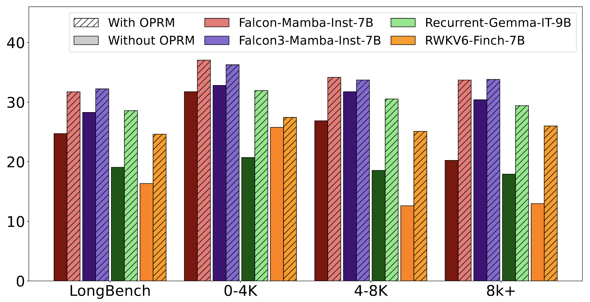
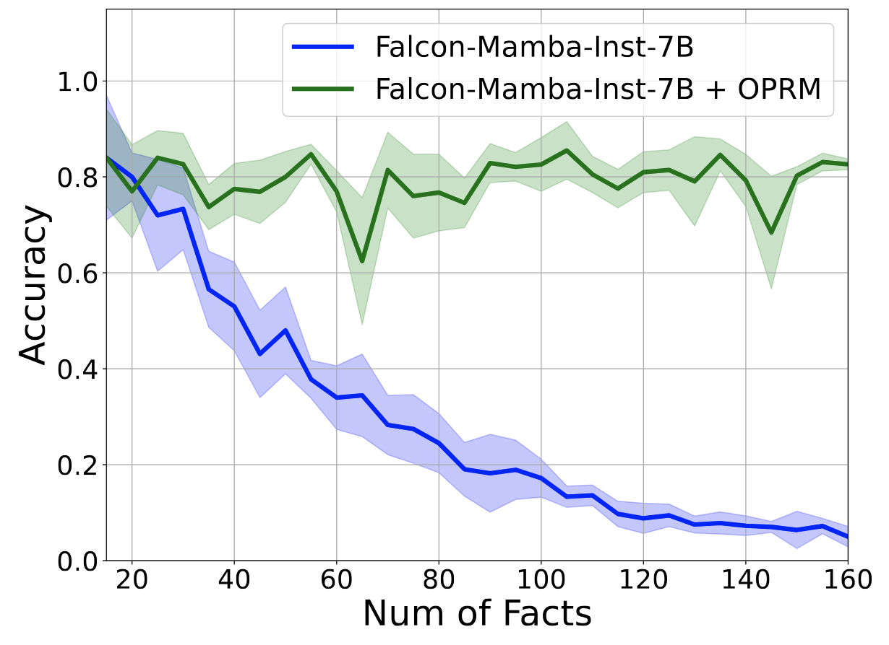

# Overflow Prevention Enhances Long-Context Recurrent Models

<p align="center">

<a href="https://assafbk.github.io/website/">Assaf Ben-Kish</a>,
<a href="https://itamarzimm.github.io/">Itamar Zimerman</a>,
<a href="https://jmiemirza.github.io/">M. Jehanzeb Mirza</a>,
<a href="https://scholar.google.co.il/citations?user=UbFrXTsAAAAJ&hl=en">Lior Wolf</a>,
<a href="https://scholar.google.com/citations?user=pfGI-KcAAAAJ&hl=en">James Glass</a>,
<a href="https://scholar.google.com/citations?user=WbO7tjYAAAAJ&hl=en">Leonid Karlinsky</a>,
<a href="https://www.giryes.sites.tau.ac.il/">Raja Giryes</a>

<!-- <a href=""></a> TODO add arxiv link -->

We present OPRM (Overflow Prevention for Recurrent Models), a training-free inference method for long-context recurrent LLMs. By mitigating recurrent memory overflows, OPRM ensures reliable inference, leading to significant gains in both synthetic and real-world long-context tasks. In addition, OPRM naturally performs context extension, allowing the model to handle sequences far longer than those it was originally trained on, all while being faster than vanilla inference and requiring a surprisingly small memory footprint.
<!-- <br><br> -->

<figure>
      <figcaption>LongBench results of leading recurrent LLMs, with and without ORPM inference.</figcaption>
       
</figure>

<figure>
      <figcaption>Associative Recall results for Falcon-Mamba-Inst-7B, with and without OPRM inference.</figcaption>
        
</figure>

In addition, our findings raise questions about whether recurrent models genuinely exploit long-range dependencies across multiple chunks, since our single-chunk strategy delivers stronger performance - even in tasks that presumably require cross-segment relations.


</p>
<br>

# Release Updates
* [6/5/2025] Code published!

<br>

# Setup
## Clone Project
```
git clone https://github.com/assafbk/OPRM.git
cd OPRM
```

Set up custom Transformers library:
```
git submodule init
git submodule update
```

## Create Environment
To set up our environment, please run:
```
conda env create -f environment.yml
conda activate oprm
```

Install custom Transformers library:
```
cd submodules/transformers
pip install -e .
```

Install for faster inference with the Falcon-Mamba models:
```
pip install "causal-conv1d>=1.4.0"
pip install mamba-ssm
```

Install for faster inference with the RWKV model:
```
pip install --no-deps git+https://github.com/sustcsonglin/flash-linear-attention
```

<br>

# Evaluate OPRM on LongBench
To run the evaluation script:
```
python eval_longbench_oprm.py --device <cuda_device> --model <model_type> --e <e> --is_oprm <is_oprm>
```
Arguments:
* \<cuda_device> - str, in the form of 'cuda:x', where x is the gpu id
* \<model_type> - str, currently supported models: 'falcon_mamba', 'falcon3_mamba', 'recurrent_gemma', 'rwkv'
* \<e> - int, 0 for LongBench, 1 for LongBench_e
* \<is_oprm> - int, 0 for vanilla inference, 1 for OPRM
<br>

## Additional Configurations (L228-243):
* \<cache_dir> - str, HuggingFace cache dir
* \<out_path_base> - str, base path for model predictions
* \<max_len_per_seg> - int, max amount of tokens allowed in a batch. useful for very long sequences, when not all context chunks fit in a single batch.
* \<chunk_sizes_to_test> - list, chunk sizes to test (L in the paper).
* \<datasets_to_test> - list, datasets to evaluate. select a subset of: ["hotpotqa", "2wikimqa", "musique", "narrativeqa", "qasper", "multifieldqa_en", "gov_report", "qmsum", "multi_news", "trec", "triviaqa", "samsum", "passage_count" "passage_retrieval_en", "lcc", "repobench-p"]
* \<dataset_ntoks> - dict, maps between dataset and max amount of tokens allowed to predict per query.
<br>
<br>


# Citation
If you find this work useful, please cite the following:
```bibtex
@misc{TODO,
      title={}, 
      author={},
      year={},
      eprint={},
      archivePrefix={},
      primaryClass={},
      url={}, 
}
```
